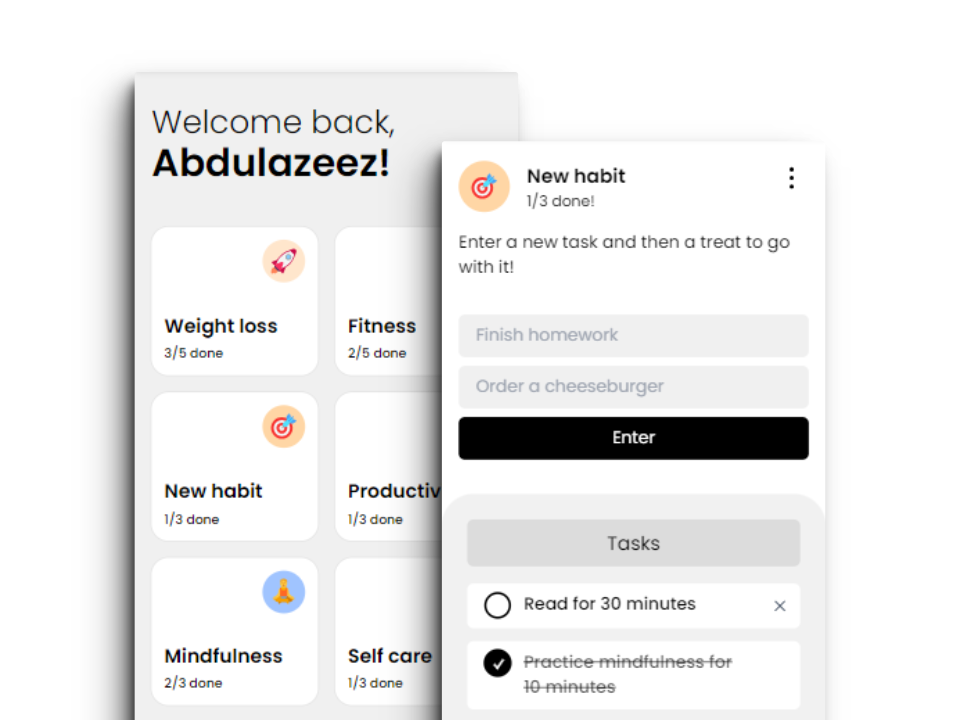

<div id="top"></div>

<div align="center">
  <div>
    <!-- Project Logo -->
    
    <!-- Project Title -->
    <p align="center">
      <i align="center"
        >A delightful todo list application where you earn treats for completing tasks 🍪✅</i
      >
    </p>
  </div>
  <!-- Project Links -->
  <p align="center">
    <br />
    <a href="https://task-and-treat.netlify.app/">View Demo</a>
    ·
    <a href="https://github.com/xyzeez/task-and-treat/issues" target="_blank">Report Bug</a>
    ·
    <a href="https://github.com/xyzeez/task-and-treat/issues" target="_blank">Request Feature</a>
  </p>
  <!-- Badges -->
  <div align="center">
    <!-- Licence -->
    <a href="#">
      
    </a>
    <!-- Status -->
    <a href="#">
      
    </a>
  </div>



</div>

## Project Description

Task and Treat is a vibrant and engaging web application designed to transform the mundane task of managing your to-do list into a delightful experience. With Task and Treat, completing tasks isn't just about productivity—it's about rewarding yourself along the way.

## Built with

 &nbsp;  &nbsp;  &nbsp;  &nbsp;

## Features

- **Interactive Todo List**: Task and Treat offers a user-friendly interface for creating, organizing, and managing your tasks effortlessly.
- **Ability to Delete a Todo Set**: Easily remove outdated or completed todo sets from your list.
- **Ability to Edit a Todo Set**: Task and Treat allows you to modify titles, emojis, and backgrounds, ensuring that your tasks are always up to date.
- **Ability to Add New Todo Items to a Set**: Expand your todo sets with additional tasks or subtasks using Task and Treat's add feature.

## Flowchart


## Installation

To install the project, follow these steps:

1. Clone the repository:

```bash
git clone https://github.com/xyzeez/task-and-treat.git
```

2. Navigate to the project directory:

```bash
cd task-and-treat
```

3. Install dependencies:

```bash
npm install
```

4. Start the application:

```bash
npm start
```

## Acknowledgements

- [@merycodes](https://x.com/merycodes/status/1758805423748997419?s=20) for providing the initial design which inspired me to build this project.
